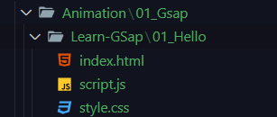
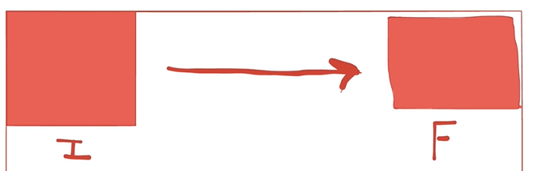

# Learn Gsap

---

## ✨ What is Gsap

- Js Animation Liberay

---

## ✨ Install Process

- `<script src="https://cdn.jsdelivr.net/npm/gsap@3.12.5/dist/gsap.min.js"></script>` add in HTML files.

---

## ✨ File Structure



---

## ✨ Start

```html
<div id="box"></div>
```

```css
html,
body {
  width: 100%;
  height: 100%;
}

#box {
  width: 300px;
  height: 300px;
  background-color: crimson;
}
```

```js
gsap.to("#box", {
  x: 500,
  y: 500,
  duration: 3,
  delay: 1,
});
```

### 📝 Note -> Describe Js Files Text

-Gsap দিয়ে কাজ করতে হলে প্রথমে `gsap.to` বা `gsap.from` দিতে হয়

- এর পরে `gsap.to("Id Or Class",{});` দিয়ে তার মধ্যে এলিমেন্ট বা "Key Value" দিতে হয়।

---

## ✨ Gsap Topics

### 🧿 From & To

- Element এর Initial থেকে final এ যেতে যেই মুভমেন্ট করে সেইটাই এলিমেন্ট ।
- 

#### To

- Initial থেকে final এ গেলে সেইটায় .to ব্যবহার করে
- ডান থেকে বামে যায় তখন .to ব্যবহার করে

```js
gsap.to("#box", {
  x: 800,
  duration: 3,
  delay: 1,
  borderRadius: 150,
});
```

#### from

- final থেকে Initial এ গেলে সেইটায় .from ব্যবহার করে
- বাম থেকে ডানে যায় তখন .from ব্যবহার করে

```js
gsap.from("#box2", {
  x: 800,
  duration: 3,
  delay: 1,
  borderRadius: 150,
});
```

#### একাসাতে একের অদিক ক্লাস দরে কাজ করতে হলে

```js
gsap.to("#box , #box2", {
  x: 800,
  duration: 3,
  delay: 1,
  borderRadius: 150,
});
```

---

### 🧿 Timeline

- Code async ভাবে চলে, একটার পরে একটা চলে
- কয়েকটা ইলিমেন্ট এ ডিউরেশন দিলে, একটার পরে একটা চলবে
- প্রথমে ভেরিএবল এর মধ্যে `timeline` ফাংশন নিতে হয় এবং এর পরে ভেরিএবল ধরে `কি,ভ্যেলু` দিতে হয়।

```js
let timeLineIs = gsap.timeline();

timeLineIs.to("#box1", {
  x: 1000,
  rotate: 360,
  duration: 1,
  delay: 1,
});

timeLineIs.to("#box2", {
  x: 1200,
  rotate: 360,
  duration: 1,
});
timeLineIs.to("#box3", {
  x: 1400,
  rotate: 360,
  duration: 1,
});
```

### 🧿 stagger

- `stagger`, একিটাইপের অনেক গুলো এলিমেন্ট থাকলে একটা একটা এনিমেট করে আসে ।
- `stagger:1` দিয়ে টাইম দেওয়া হয়। -1 ও দেওয়া যায়।

```js
gsap.from("h1", {
  opacity: 0,
  color: "red",
  duration: 3,
  delay: 1,
  y: 20,
  // stagger: -1,
  // stagger: 1,
  stagger: 0.3,
});
```

### 🧿 Repeat

- `Repeat : 1` দিলে ২ বার চলবে
- `Repeat : -1` দিলে ইনফাইনাইট বার চলবে

```js
gsap.to("#box4", {
  x: 500,
  duration: 3,
  delay: 1,
  // repeat: 1,
  repeat: -1,
  borderRadius: 50,
});
```

### 🧿 YOYO

- initial To final & Final TO Initial
- yoyo দিলে x - ০ থেকে ফাইনা ভ্যালু তে যাবে এবং ফাইনাল ভ্যালু থেকে ০ তে যাবে
- yoyo - true Or False এ হয়।

```js
gsap.to("#box4", {
  x: 500,
  duration: 3,
  delay: 1,
  // repeat: 1,
  repeat: -1,
  yoyo: true,
  borderRadius: 50,
  rotate: 180,
});
```

---

## ✨ scrollTrigger

- Scroll এর মাধ্যেমে একটা এলিমেন্ট এর এনিমেশন কখন চলবে সেইটা নির্ধারন করে দেওয়া যায়।
- `https://cdnjs.cloudflare.com/ajax/libs/gsap/3.12.5/ScrollTrigger.min.js` এই CDN টা Gsap এর পরে দিতে হবে।

### 🧿 scrollTrigger

- scrollTrigger : "ElementId"

```js
gsap.from("#page2 #box", {
  scale: 0,
  delay: 2,
  duration: 2,
  rotate: 360,
  // scrollTrigger: "#page2 #box",
  scrollTrigger: {
    trigger: "#page2 #box",
    scroller: "body",
    markers: true,
    start: "top 60%",
  },
});
```

#### 🧿 trigger: "elementID",

- কোন এলিমেন্ট এ ট্রিগার করবে বা এনিমেট করবে

#### 🧿 scroller: "body"

- বBody এর মধ্যে স্ক্রল হবে।

#### 🧿 markers: true,

- Page এর Start & End Point দেখাবে

#### 🧿 start: "top 60%"

- এই এলিমেন্ট টা উপর থেকে ৬০% আসলে এনিমেন্ট হবে । markers এর জন্য মার্ক দেখা যায়।

# [Next](১ঃ১১ঃ৪৯)
